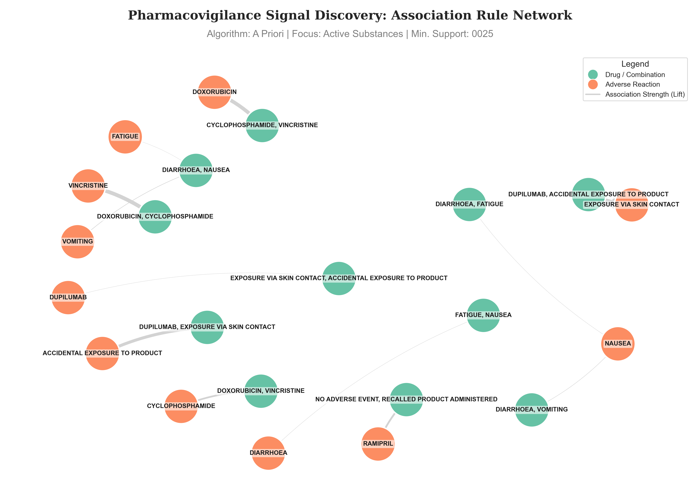
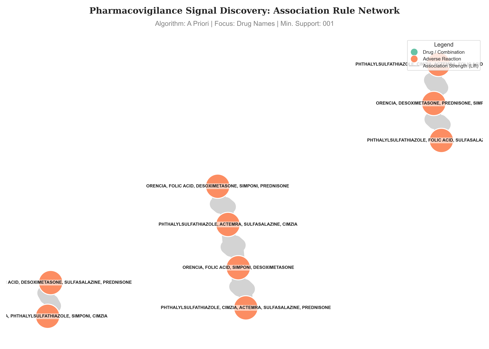
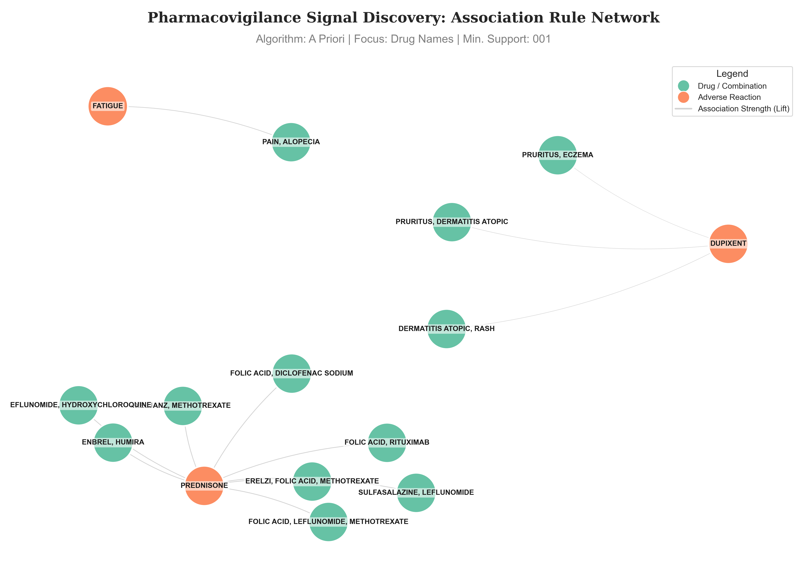

# Predicting High-Risk Drug Interactions in FAERS Data

[](https://www.python.org/downloads/)
[](https://opensource.org/licenses/MIT)
[](https://open.fda.gov/data/faers/)

##  Introduction
Adverse Drug Events (ADEs) are a leading cause of hospitalization and mortality worldwide. This project leverages the **FDA Adverse Event Reporting System (FAERS)** to monitor post-market drug safety. 

By analyzing quarterly data from 2025, this research aims to uncover hidden patterns in drug co-prescription that lead to severe clinical outcomes. The ultimate goal is to alert  to undocumented or high-risk **Drug-Drug Interactions (DDIs)** through data-driven insights.

---

##  Research Problems

1.  **Task A: Interaction Mining:** Identifying specific drug combinations (Drug A + Drug B) with strong statistical associations to life-threatening reactions using Association Rule Mining (comparing Apriori and FP-Growth algorithms).
2.  **Task B: Severity Prediction:** Developing a classification pipeline to predict the clinical severity level of a report based on patient demographics and medication history.

---

## Installation

To run this project, you need to have **Python 3.10+** installed. 

1. Clone the repository and navigate to the project folder.
2. Install the required libraries using `pip`:

```bash
pip install -r requirements.txt
```

##  Data Description and Visualization

* **Source:** [openFDA / FAERS API](https://open.fda.gov/apis/drug/event/)
* **Sample Size:** 108,000 records corresponding to 9 JSON files from 2025.
* **Key Features:** 
    * **Demographics:** Patient age and sex.
    * **Medication:** Medicinal product name, active substance.
    * **Clinical:** Reported reactions and seriousness indicator.


#### 1. Seriousness and Demographics
This plot illustrates the distribution of adverse event outcomes and the gender breakdown of the reported cases.

<p align="center">
  
</p>


#### 2. Severity Indicators


<br/><br/><br/>
<br/><br/><br/>

A detailed breakdown of the specific seriousness criteria reported (Hospitalization, Death, Disabling, etc.).

<br clear="right"/>

#### 3. Drug Frequency Analysis
Comparison between reported Brand Names and their corresponding Active Substances.

| Brand Names | Active Substances |
| :---: | :---: |
|  |  |

#### 4. Transactional Complexity
Distributions showing how many unique items are present per report, justifying the use of Association Rule Mining.
<p align="center">

</p>
---

## Technical Implementation of Task A: Interaction Mining (Association Rules)

### 1. Data Fields Selection - Dimensionality Reduction

To ensure high performance and follow the principle of **Dimensionality Reduction**, we selected only the most relevant fields from the 69 available in the FAERS dataset. This reduces noise and improves the statistical significance of our models.
 
Task A focuses on finding relationships between drugs and adverse reactions.

* **`safetyreportid`**: Acts as the **Transaction ID**. It allows us to group multiple drugs and symptoms into a single "basket" or medical case.
* **`patient.drug.medicinalproduct`**: The commercial brand name. Used to identify associations between specific medications.
* **`patient.drug.activesubstance.activesubstancename`**: The generic active ingredient. This is used to handle redundancy (merging different brands with the same chemical component).
* **`patient.reaction.reactionmeddrapt`**: The standardized medical term for the reaction. This serves as the **Item Label** or "consequent" in our association rules.

### 2. Data Preprocessing
* Parsing semi-structured **JSON** payloads from the openFDA API.
* Flattening nested lists of drugs and reactions into a relational format for machine learning.
* Feature engineering on drug classes and patient age buckets.

### 3. Modeling Pipeline: Association Rules

The Apriori and FP-Growth algorithms were implemented to extract frequent itemsets and derive rules evaluated by Support, Confidence, and Lift metrics.

* **Minimum Support Threshold Selection**:
The minimum support acts as a statistical filter that removes isolated or rare clinical occurrences, ensuring the algorithms only analyze patterns with sufficient frequency to be medically significant. Through iterative testing, an optimal baseline of **0.0025 (0.25%)** was established. 

* **Apriori vs. FP-Growth Comparison**:
Both the Apriori and FP-Growth algorithms were implemented to compare their outputs and verify if the choice of algorithm impacted the final association rules. During exploratory testing at a lower support threshold of 0.001, significant computational bottlenecks and memory allocation failures (`MemoryErrors`) were encountered across almost all configurations due to the massive number of potential item combinations. Ultimately, the 0.0025 threshold proved to be the optimal operating point; at this level, both algorithms successfully processed the data without triggering memory limits.

### 4. Results and Evaluation

Following the modeling pipeline, the raw rules were subjected to a **Deep Filtering** step. This was crucial to remove administrative terms or "indication bias" (instances where a drug was simply linked to the disease it is intended to treat rather than a genuine side effect). 

#### **4.1 Evaluation of Feature Focus**
Two different feature spaces were evaluated during this phase: **Brand Names**  versus **Active Substances**. 

Selecting active substances over brand names proved essential for reducing noise and maintaining scientific rigor in the Knowledge Discovery in Databases (KDD) process. Commercial brands often fragment identical chemical profiles, which dilutes statistical significance and obscures true signals. By consolidating these redundant labels into their core active components, the dataset achieved higher intra-class similarity, allowing the algorithms to detect adverse reactions with substantially higher Support and Lift. This approach acted as a form of Feature Reduction that isolated genuine Drug-Drug Interactions (DDI), transforming high-dimensional data into clear, actionable intelligence.

<p align="center">

</p>
<p align="center">
<i><b>Figure 1:</b> Pharmacovigilance Signal Discovery Network using the Apriori algorithm on Active Substances (Support: 0.0025). Teal nodes represent active substances or drug combinations, while coral nodes indicate the resulting adverse reactions. Edge thickness corresponds to the association strength (Lift).</i>
</p>

#### **4.2 Quantitative Evaluation of Filtered Rules**

The empirical metrics from the successful runs confirm the consistency of the chosen algorithms and feature sets:

| Model Configuration | Total Rules Found | Max Lift | Avg. Confidence | Unique Reactions | Status |
| :--- | ---: | ---: | ---: | ---: | :--- |
| **Active Substances (Apriori) - 0.0025** | 13 | 223.45 | 0.6367 | 11 | **Success (Excellent)** |
| **Active Substances (FP-Growth) - 0.0025** | 13 | 223.45 | 0.6367 | 11 | **Success (Excellent)** |
| **Drug Names (Apriori) - 0.0025** | 13 | 224.13 | 0.6367 | 11 | Success (Good) |
| **Drug Names (FP-Growth) - 0.0025** | 13 | 224.13 | 0.6367 | 11 | Success (Good) |
| **Drug Names (Apriori) - 0.001** | 352,484 | 851.08 | 0.8300 | 6,878 | Success (Too Noisy) |
| **Others (All Categories) - 0.001** | N/A | N/A | N/A | N/A | **Failed (Memory Error)** |

At the 0.0025 support threshold, both Apriori and FP-Growth extracted the exact same number of genuine medical rules with identical average confidence and maximum lift across their respective feature sets. This confirms that both algorithms are mathematically consistent in their pattern discovery, yielding identical output sets.

### 5. Sensitivity Analysis: Impact of the Critical Support Threshold (0.001)

To validate the model's robustness and understand the limits of lower thresholds, an in-depth experiment was conducted on the single successful 0.001 run (`Drug Names (Apriori) - 0.001`). This analysis revealed that an excessively low threshold compromises the quality of the extracted knowledge in two distinct ways, depending on the sorting metric utilized:

#### **A. Mathematical Noise Explosion (High Lift)**
When sorting by the **highest Lift**, the network becomes dominated by extreme mathematical coincidences (Lift > 850). These rules represent extremely rare events (fortuitous combinations of multiple drugs and symptoms occurring in only one or two patients) that do not constitute a reliable statistical signal, but rather "noise" that saturates the system.

<p align="center">

<br><i><b>Figure 2:</b> Network with 0.001 support sorted by highest Lift. Visual saturation is observed due to the extreme magnitude of spurious associations.</i>
</p>

#### **B. Co-prescription Patterns vs. Medical Signals (Low Lift)**
When filtering for high Confidence but with the **lowest Lift** (displaying the most common and predictable associations), the network becomes visually clean but loses its value for pharmacovigilance. Instead of discovering adverse reactions (orange consequent nodes), the algorithm identifies **polypharmacy patterns** (medications that are frequently prescribed together). 

For instance, the network correctly detects that patients with autoimmune diseases taking *Humira* or *Methotrexate* almost always receive *Prednisone* as well. Although this pattern is real, it represents an "indication bias" and standard treatment protocols rather than the discovery of a novel safety risk.

<p align="center">

<br><i><b>Figure 3:</b> Network with 0.001 support sorted by lowest Lift. The central orange nodes are medications (e.g., Prednisone, Dupixent) instead of symptoms, revealing treatment protocols rather than side effects.</i>
</p>

### 6. Final Conclusion

The KDD pipeline successfully extracted meaningful pharmacovigilance signals from the FAERS dataset. Through rigorous empirical testing, we determined that a support threshold of **0.0025** acts as the optimal analytical sweet spot. Thresholds lower than this either cause severe computational failures (`MemoryErrors`) or generate a massive volume of clinical noise and indication bias (as demonstrated by the 352,484 rules generated at the 0.001 level). 

Furthermore, implementing both **Apriori** and **FP-Growth** allowed us to cross-verify our results; both algorithms yielded identical rule sets at the optimal threshold, confirming the mathematical consistency of our methodology. Finally, prioritizing **Active Substances** over commercial Drug Names acted as a highly effective feature reduction technique, successfully consolidating redundant data into actionable, medically accurate safety signals.

## Technical Implementation of Task B: Severity Prediction (Supervised Learning)
### 1. Data Fields Selection - Dimensionality Reduction
This task uses patient profiles to predict the clinical outcome of a report.
* **`patient.patientonsetage`**: A numerical feature used for risk assessment, as age often correlates with reaction severity.
* **`patient.patientsex`**: A categorical feature (1=Male, 2=Female) used to capture biological differences in drug responses.
* **`seriousnessindicators`**: Fields such as `seriousnessdeath` or `seriousnesshospitalization` are consolidated to create our **Target Label** (Serious vs. Non-Serious).
* **`patient.reaction.reactionoutcome`**: Used for multi-class classification to provide deeper insights into the patient's recovery status.
### 2. Data Processing
### 3. Modeling Pipeline:
**Classification:** Logistic Regression, Random Forest, and Support Vector Machines (SVM).


##  Expected Outcomes

* **DDI Ranking:** A prioritized list of the most dangerous drug-drug interactions found in recent data.
* **Model Benchmarking:** A comparative analysis showing which predictive models best handle sparse medical event data.
* **Automated Pipeline:** A Python-based framework for converting raw medical JSON into actionable clinical insights.

