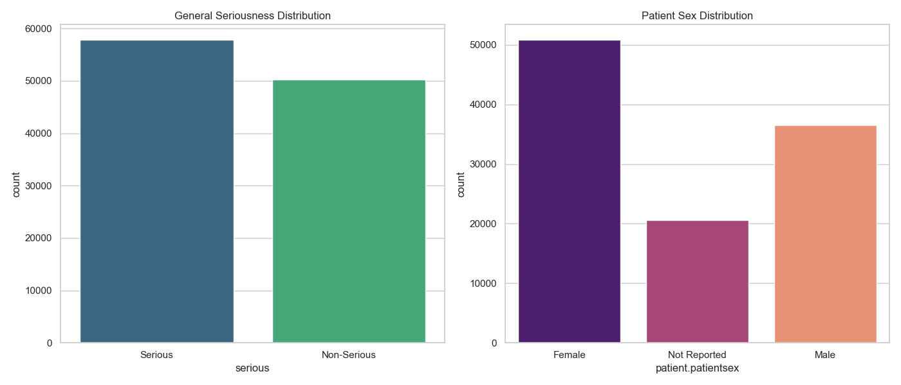
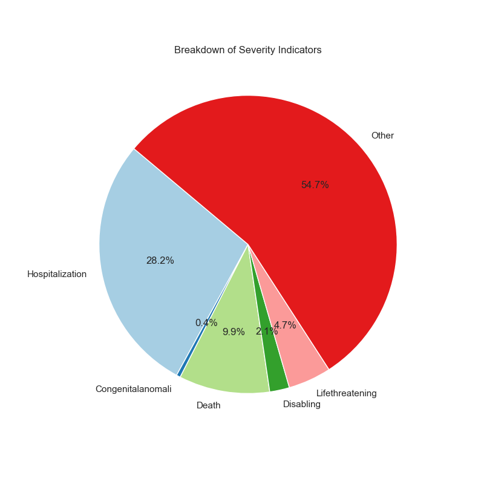
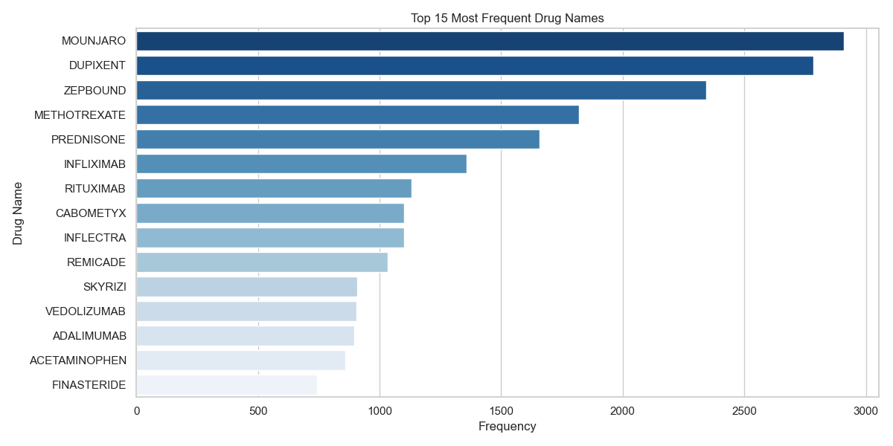
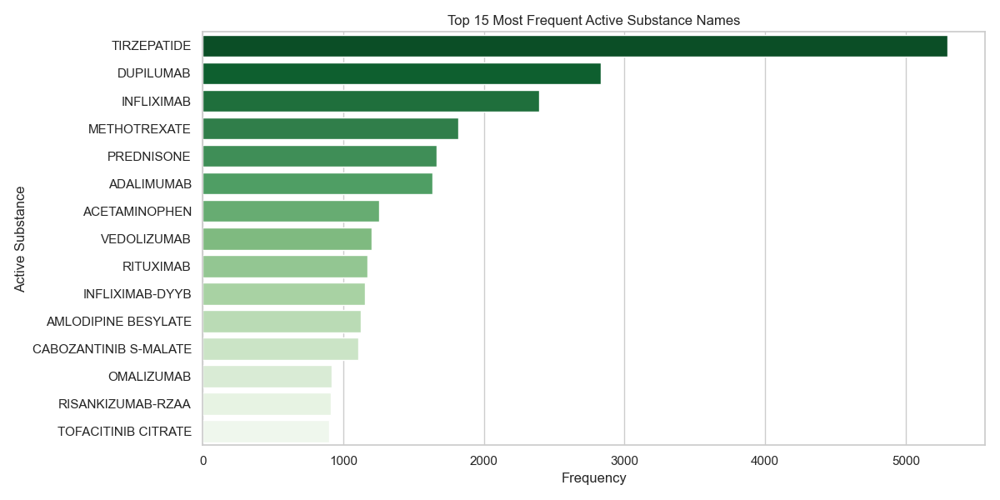
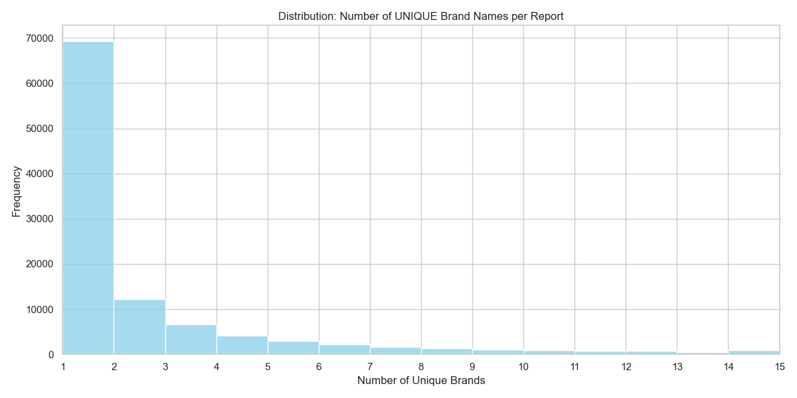

# Predicting High-Risk Drug Interactions in FAERS Data

[](https://www.python.org/downloads/)
[](https://opensource.org/licenses/MIT)
[](https://open.fda.gov/data/faers/)

##  Introduction
Adverse Drug Events (ADEs) are a leading cause of hospitalization and mortality worldwide. This project leverages the **FDA Adverse Event Reporting System (FAERS)** to monitor post-market drug safety. 

By analyzing quarterly data from 2025, this research aims to uncover hidden patterns in drug co-prescription that lead to severe clinical outcomes. The ultimate goal is to alert  to undocumented or high-risk **Drug-Drug Interactions (DDIs)** through data-driven insights.

---

##  Research Problems

1.  **Task A: Interaction Mining:** Identifying specific drug combinations (Drug A + Drug B) with strong statistical associations to life-threatening reactions using Association Rule Mining (comparing Apriori and FP-Growth algorithms).
2.  **Task B: Severity Prediction:** Developing a classification pipeline to predict the clinical severity level of a report based on patient demographics and medication history.

---

## Installation

To run this project, you need to have **Python 3.10+** installed. 

1. Clone the repository and navigate to the project folder.
2. Install the required libraries using `pip`:

```bash
pip install -r requirements.txt
```

##  Data Description and Visualization

* **Source:** [openFDA / FAERS API](https://open.fda.gov/apis/drug/event/)
* **Sample Size:** 108,000 records corresponding to 9 JSON files from 2025.
* **Key Features:** 
    * **Demographics:** Patient age and sex.
    * **Medication:** Medicinal product name, active substance.
    * **Clinical:** Reported reactions and seriousness indicator.


#### 1. Seriousness and Demographics
This plot illustrates the distribution of adverse event outcomes and the gender breakdown of the reported cases.

<p align="center">
  
</p>


#### 2. Severity Indicators



<br/><br/><br/>
<br/><br/><br/>

A detailed breakdown of the specific seriousness criteria reported (Hospitalization, Death, Disabling, etc.).

<br clear="right"/>

#### 3. Drug Frequency Analysis
Comparison between reported Brand Names and their corresponding Active Substances.

| Brand Names | Active Substances |
| :---: | :---: |
|  |  |

#### 4. Transactional Complexity
Distributions showing how many unique items are present per report, justifying the use of Association Rule Mining.
<p align="center">

<<<<<<< HEAD

=======
</p>
---
>>>>>>> 1955e72953dbf40656d94c06cc967459abbbc3f9


## Technical Implementation of Task A: Interaction Mining (Association Rules)

### 1. Data Fields Selection - Dimensionality Reduction

To ensure high performance and follow the principle of **Dimensionality Reduction**, we selected only the most relevant fields from the 69 available in the FAERS dataset. This reduces noise and improves the statistical significance of our models.
 
Task A focuses on finding relationships between drugs and adverse reactions.

* **`safetyreportid`**: Acts as the **Transaction ID**. It allows us to group multiple drugs and symptoms into a single "basket" or medical case.
* **`patient.drug.medicinalproduct`**: The commercial brand name. Used to identify associations between specific medications.
* **`patient.drug.activesubstance.activesubstancename`**: The generic active ingredient. This is used to handle redundancy (merging different brands with the same chemical component).
* **`patient.reaction.reactionmeddrapt`**: The standardized medical term for the reaction. This serves as the **Item Label** or "consequent" in our association rules.


### 2. Data Preprocessing
* Parsing semi-structured **JSON** payloads from the openFDA API.
* Flattening nested lists of drugs and reactions into a relational format for machine learning.
* Feature engineering on drug classes and patient age buckets.

### 3. Modeling Pipeline: Association Rules
**Association Rules:** Apriori and FP-Growth to determine Support, Confidence, and Lift.

* ** Apriori**:

The minimum support acts as a statistical threshold that filters out rare medications and reactions, ensuring the algorithm only analyzes items with enough frequency to be significant. While we set a baseline of 0.01 (1%), we adjust this value to 0.005 (0.5%) to capture less frequent but clinically relevant associations that a higher threshold would ignore.

A support that is too high (10%) would only find extremely obvious rules and very few results (like taking a drug causes a headache), while a support that is too low (0.0001%) would include rare "noise" and likely crash the system by generating millions of insignificant rules

* **FP-Growth (Frequent Pattern Growth)**:

We moved from Apriori to FP-Growth because we encountered a computational bottleneck with Apriori a support of 0.5% does not show any drug interactions, and we lower the support the computer breaks down because of memory allocation.


## Technical Implementation of Task B: Severity Prediction (Supervised Learning)
### 1. Data Fields Selection - Dimensionality Reduction
This task uses patient profiles to predict the clinical outcome of a report.
* **`patient.patientonsetage`**: A numerical feature used for risk assessment, as age often correlates with reaction severity.
* **`patient.patientsex`**: A categorical feature (1=Male, 2=Female) used to capture biological differences in drug responses.
* **`seriousnessindicators`**: Fields such as `seriousnessdeath` or `seriousnesshospitalization` are consolidated to create our **Target Label** (Serious vs. Non-Serious).
* **`patient.reaction.reactionoutcome`**: Used for multi-class classification to provide deeper insights into the patient's recovery status.
### 2. Data Processing
### 3. Modeling Pipeline:
**Classification:** Logistic Regression, Random Forest, and Support Vector Machines (SVM).


##  Expected Outcomes

* **DDI Ranking:** A prioritized list of the most dangerous drug-drug interactions found in recent data.
* **Model Benchmarking:** A comparative analysis showing which predictive models best handle sparse medical event data.
* **Automated Pipeline:** A Python-based framework for converting raw medical JSON into actionable clinical insights.

